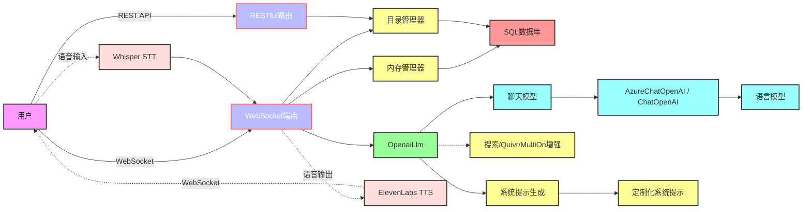
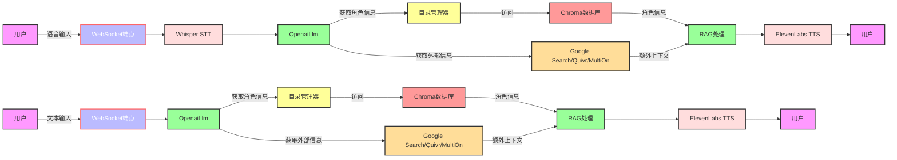
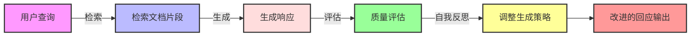
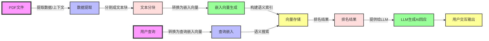
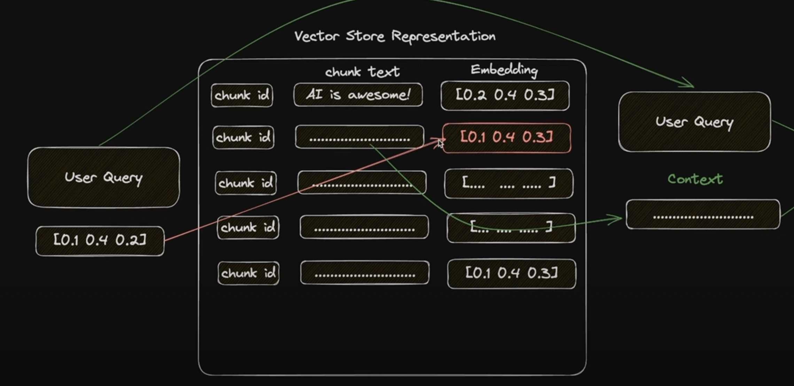
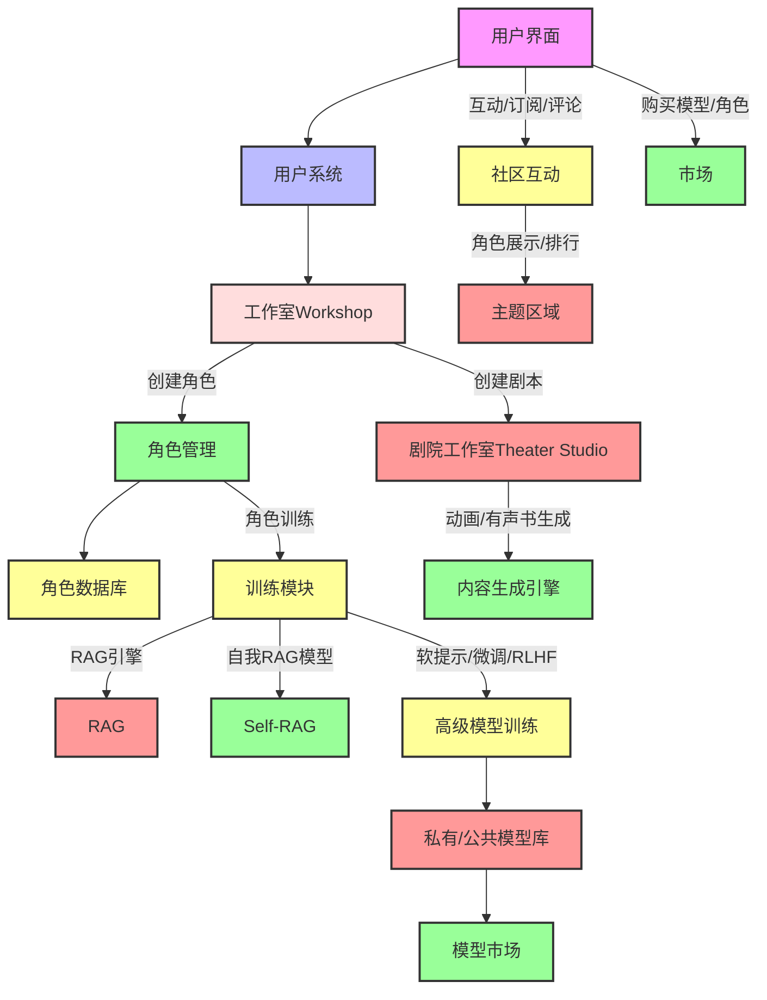

# 项目概述

## 项目目标
该项目旨在创建一个以交互式AI角色为中心的平台，可能用于聊天机器人、虚拟助手服务或娱乐应用。

## 主要组件

### `main.py`
- **功能**: 设置并初始化FastAPI应用程序，配置跨域资源共享（CORS）和静态文件路由。
- **关键点**: 集成了RESTful API和WebSocket路由，以及静态文件服务。

### `CatalogManager`
- **功能**: 管理角色目录，包括从文件系统和数据库加载角色数据。
- **关键点**: 作为角色数据管理的核心。

### `MemoryManager`
- **功能**: 管理用户会话和相关数据。
- **关键点**: 设计为单例模式，可能用于跟踪用户交互和管理对话历史。

### WebSocket端点 (`websocket_endpoint`)
- **功能**: 处理WebSocket连接，实现实时用户交互。
- **关键点**: 支持多语言交互，处理文本和语音输入。

### 数据库模型
- **`Character`**: 存储角色信息，如名称、提示等。
- **`Feedback`**: 存储用户反馈。
- **`Interaction`**: 记录用户和系统之间的互动。
- **`Memory`**: 管理记忆实体，可能用于存储用户相关数据。

### `OpenaiLlm`
- **功能**: 与OpenAI的语言模型接口，提供会话AI功能。
- **关键点**: 集成了搜索代理和Quivr代理，增强语言模型响应。

### `system_prompt_generator.py`
- **功能**: 动态生成基于角色的系统提示。
- **关键点**: 使用语言模型来根据提供的模板和背景信息生成定制的提示。

## 应用流程

1. **用户交互**: 用户通过WebSocket连接与系统进行实时对话，可以通过文本或语音输入与系统交互。
2. **角色管理**: `CatalogManager`负责处理角色数据，用户可以与不同虚拟角色互动。
3. **数据处理**: `MemoryManager`处理用户会话数据，保持交互上下文。
4. **动态内容生成**: 使用`OpenaiLlm`和`system_prompt_generator`生成定制化的角色响应和系统提示。




## 语音输入及处理流程（RAG模型）
1. **用户**: 发起语音输入。
2. **WebSocket端点**: 接收用户的语音数据。
3. **Whisper STT**: 将语音数据转换为文本。
4. **OpenaiLlm**: 处理转换后的文本。
5. **目录管理器**: 根据用户会话或请求获取特定角色信息（RAG检索部分）。
6. **Chroma数据库**: 存储和检索角色相关信息。
7. **Google Search/Quivr/MultiOn**: 获取其他相关信息和上下文。
8. **生成回应**: 利用RAG模型结合所有信息生成回应。
9. **ElevenLabs TTS**: 将文本回应转换为语音。
10. **用户**: 接收系统的语音回应。

## 文本输入及处理流程（RAG模型）
1. **用户**: 通过键入发送文本消息。
2. **WebSocket端点**: 接收用户的文本输入。
3. **OpenaiLlm**: 直接处理文本输入。
4. **目录管理器**: 获取角色信息（RAG检索部分）。
5. **Chroma数据库**: 存储和检索角色信息。
6. **Google Search/Quivr/MultiOn**: 获取其他相关信息和上下文。
7. **生成回应**: 结合RAG模型生成回应。
8. **ElevenLabs TTS**: （如需）将文本回应转换为语音。
9. **用户**: 接收系统的文本或语音回应。

## 以下是流程图



## Self-RAG模型全面介绍

Self-RAG模型结合了检索（Retrieve）和生成（Generate）方法，并增加了自我批评（Self-critique）过程以提高回应质量。

1. **检索阶段**：模型从知识库检索与用户查询相关的文档片段。
2. **生成阶段**：基于检索到的文档片段，模型生成回应。
3. **自我批评**：批评模型评估生成的回应，考虑相关性、连贯性、事实准确性和流畅性。
4. **自我反思**：模型根据批评模型的反馈调整其生成策略。
5. **输出改进回应**：这个过程有助于确保最终输出更准确、相关。

这种方法通过确保考虑和批评其生成的内容来提高模型输出的准确性和相关性。

## Self-RAG模型具体示例

假设用户向Self-RAG模型提问：“可再生能源的好处是什么？”

1. **检索**：模型首先从知识库检索与可再生能源相关的信息。
2. **生成**：基于这些信息，模型生成回应，例如：“可再生能源的好处在于它减少了温室气体排放，并且是一种可持续的能源。”
3. **批评/评估**：
   - **相关性**：批评模型检查回应是否与可再生能源相关。
   - **连贯性**：评估回应是否逻辑上解释了好处。
   - **事实准确性**：核实关于排放和可持续性的声明的准确性。
   - **流畅性**：确保回应语法正确且流畅。
4. 如果批评模型发现任何问题（例如，事实上的不准确或缺乏连贯性），Self-RAG模型调整其回应。例如，如果原始回应缺乏具体示例，修正后的回应可能包括：“例如，太阳能减少了对化石燃料的依赖，风能不产生二氧化碳排放。”
5. 然后向用户呈现这个精炼的回应，确保它是准确、相关且连贯的。




# 内存模块概述

```mermaid
graph LR
    A[新用户输入] -->|接收输入| B[记忆模块]
    B -->|回顾最近的上下文| C[更新上下文]
    C -->|整合新输入| D[更新的会话缓冲区]
    D -->|提供给LLM| E[LLM]
    E -->|生成回应| F[输出回应]
    F -->|存储在记忆中| G[存储在记忆模块]
    G -->|用于未来的交流| H[更新记忆]

    style A fill:#f9f,stroke:#333,stroke-width:2px
    style B fill:#bbf,stroke:#333,stroke-width:2px
    style C fill:#fdd,stroke:#333,stroke-width:2px
    style D fill:#9f9,stroke:#333,stroke-width:2px
    style E fill:#ff9,stroke:#333,stroke-width:2px
    style F fill:#f99,stroke:#333,stroke-width:2px
    style G fill:#9f9,stroke:#333,stroke-width:2px
    style H fill:#fdd,stroke:#333,stroke-width:2px


```



内存模块旨在解决像GPT-3这样的语言模型（LLM）的无状态特性。它能够有效地保留过去对话的信息，使LLM能够提供与上下文相关的回应。这一模块对于保持交互的连续性和增强整体对话体验至关重要。LangChain提供了多种类型的内存模块，每种都适用于不同的项目需求。

## 主要内存类型及其优缺点

### 1. 会话缓冲内存 (Conversation Buffer Memory)
- **优点**:
  - 提供完整的对话历史，使AI可以引用之前的任何对话部分。
  - 增强上下文理解，提供更相关和个性化的回应。
- **缺点**:
  - 随着存储的对话增长可能导致性能问题，可能会减慢回应时间。
  - 对于非常长的对话不实用，因为会增加代币计数和相关成本。

### 2. 实体内存 (Entity Memory)
- **优点**:
  - 高效跟踪和回忆对话中提到的特定实体（如名字、日期和地点）。
  - 对需要回忆具体细节或事实的对话非常有用。
- **缺点**:
  - 可能无法捕捉到对话的更广泛上下文，仅关注离散实体。
  - 需要复杂的解析能力来准确识别和存储实体。

### 3. 窗口内存 (Window Memory)
- **优点**:
  - 仅保留对话的最新部分，确保AI的回应基于即时上下文。
  - 与存储整个对话历史相比，减少了内存负载和处理时间。
- **缺点**:
  - 可能会错过对话早期部分的重要上下文。
  - 不适合需要历史上下文理解的对话。

### 4. VectorStoreRetrieverMemory (向量存储检索内存)
`VectorStoreRetrieverMemory` 通过在向量存储中保存对话片段，每次调用时检索最相关的文档。与其他内存类不同，它不追踪交互的顺序，而是侧重于语义相关性。

#### 创建和使用
- 使用向量存储检索器实例化内存对象。
- 可以保存对话中的重要信息，如用户喜好。
- 在 `ConversationChain` 中使用时，通过历史片段辅助LLM生成回应。

#### 应用实例
- 在交互中提取关键信息，如用户先前提到的喜好。
- 即使是无状态的LLM也可以“理解”时间的相关性，提供有上下文的回应。

## ChatGPT的内存使用及原因

- **ChatGPT内存使用**:
  - ChatGPT通常使用类似会话缓冲内存的机制，存储和引用当前对话会话中的信息。
  - 这允许ChatGPT保持对话的连贯性，并对之前的对话内容做出上下文相关的回应。

- **为何使用这种内存**:
  - 因为ChatGPT旨在模拟连贯的对话体验，记住用户的前言和问题对于生成连贯、相关和个性化的回应至关重要。
  - 这种内存机制有助于ChatGPT更好地理解和响应用户的需求，创造更自然和吸引人的对话体验。

# Catalog Manager 概述

Catalog Manager 是负责管理和索引来自各种数据源的信息的系统组件。在基于PDF文件提取知识的场景中，它执行以下关键功能：

1. **管理数据**：组织和存储从PDF等数据源提取的信息。
2. **处理数据**：将数据预处理和分解，使其适合生成嵌入向量。
3. **索引建立**：创建和维护嵌入向量索引，以便进行高效的语义搜索。
4. **查询处理**：处理用户查询，并将其与索引数据匹配。
5. **与LLM交互**：利用检索到的数据块提供的上下文，通过语言模型（如GPT）生成回应。

通过使用向量存储进行语义搜索，Catalog Manager 增强了语言模型提供相关和有根据的答案的能力，使其能够高效地响应用户查询并提供信息丰富的交互体验。



## RecursiveTextSplitter (递归文本分割器)

`RecursiveTextSplitter` 是 LangChain 提供的工具，专门用于将文本按语义含义拆分成更小的文本块。它可以处理不同层次的文本粒度：

- 段落 (`\n\n`)
- 句子或换行 (`\n`)
- 单词 (`" "` 空格)
- 字符 (`""` 空字符串)

这种分割功能允许维持尽可能多的语义联系，对于随后的语言模型处理或其他分析工具非常重要。

## 用户查询和向量存储过程

当用户提交查询时，系统会经历以下步骤：

1. **用户查询**：接收用户的查询并将其转换成一个嵌入向量。
2. **向量存储表示**：此嵌入向量与包含不同文本块嵌入的向量存储进行比较。
3. **语义匹配**：识别最接近匹配的嵌入向量所对应的文本块。
4. **上下文检索**：检索与查询语义最相关的文本块，并作为上下文提供。
5. **LLM处理**：使用检索到的上下文，通过语言模型（如GPT）生成回应或继续相关处理。

这一过程是依赖于语义搜索的系统的核心，确保能够提供与用户输入语义相关的信息或回应。

```mermaid
graph LR
    A[用户查询] -- 转换为嵌入向量 --> B[向量存储]
    B -- 识别匹配的文本块 --> C[语义匹配]
    C -- 检索相关文本块 --> D[上下文检索]
    D -- 输入语言模型 --> E[LLM处理]
    E -- 生成响应 --> F[用户交互输出]

    style A fill:#f9f,stroke:#333,stroke-width:4px
    style B fill:#bbf,stroke:#333,stroke-width:2px
    style C fill:#fdd,stroke:#333,stroke-width:2px
    style D fill:#9f9,stroke:#333,stroke-width:2px
    style E fill:#ff9,stroke:#333,stroke-width:2px
    style F fill:#f99,stroke:#333,stroke-width:2px

```





### [huggingface embedding model benchmark](https://huggingface.co/spaces/HuggingFaceH4/open_llm_leaderboard)


### Agent

#### [Quivr](https://www.quivr.app/brains-management/50a10b56-69d3-45e0-876c-44bf27d7fa93)

#### [MultiOn](https://www.multion.ai/)

## Zero-shot, One-shot, and Few-shot Learning Examples

### 零次学习 (Zero-shot Learning)
在没有先前接触过类似任务的情况下，要求模型执行任务。

**示例:**
```plaintext
任务: 将“Hello, how are you?”翻译成法语。
模型基于其预先训练的知识执行任务。
```

### 一次学习 (One-shot Learning)
在只有一些先前接触过类似任务的情况下，要求模型执行任务。

**示例:**
```plaintext
给定示例: “The cat sat on the mat.” → “Le chat s'est assis sur le tapis.”
任务: 将“The dog barked at the mailman.”翻译成法语。
模型应用学到的模式于新句子。
```

### 少次学习 (Few-shot Learning)
在要求模型执行新任务之前，你提供几个示例 。

**示例:**
```plaintext
给定示例:
1. “The quick brown fox jumps over the lazy dog.” → “El rápido zorro marrón salta sobre el perro perezoso.”
2. “I will travel to France next month.” → “Viajaré a Francia el próximo mes.”
任务: 将“She enjoys playing the piano.”翻译成西班牙语。
模型使用给定的示例来理解并翻译新句子。
```
## 机器学习模型调整方法

### 微调 (Fine-Tuning)
- **描述**: 在特定任务的数据集上训练整个模型，调整所有模型参数。
- **例子**: 有一个预训练的语言理解模型，在情感分析数据集上进行进一步训练，优化情感分析表现。

### 提示调整 (Prompt Tuning)
- **描述**: 在模型输入中添加特定的文本提示，引导模型产生期望的输出。
- **例子**: 给GPT-3模型输入：“翻译成法语：apple”，其中“翻译成法语：”是提示。

### 软提示 (Soft Prompt)
- **描述**: 在模型输入中添加可训练的嵌入（非固定文本），这些嵌入在训练过程中被调整。
- **例子**: 为GPT-3模型添加一组可学习的嵌入向量作为输入的一部分，用于特定任务适应。

### 硬提示 (Hard Prompt)
- **描述**: 在模型输入中添加固定的文本作为输入的一部分。
- **例子**: 在给BERT模型的文本前面加上特定的句子或短语，如“这段评论的情感是：”进行情感分析。

每种方法适用于不同场景，具有各自的优缺点。微调提供最大灵活性和性能，但需要大量数据和计算资源。提示调整和软提示提供轻量级任务适应方法，而硬提示适用于快速特定任务实现。

    


# AI角色聊天机器人平台架构图

## 平台主要组件
1. **用户系统**: 管理用户账户和权限。
2. **工作室(Workshop)**: 允许用户创建和定制角色。
3. **角色管理**: 负责角色的创建和维护。
4. **角色数据库**: 存储角色信息。
5. **剧院工作室(Theater Studio)**: 创作和安排剧本演出。
6. **内容生成引擎**: 用于生成动画或有声书。
7. **训练模块**: 提供不同的模型训练方法。
8. **RAG/自我RAG模型**: 用于基本的角色生成和高级自我反思模型。
9. **软提示/微调/RLHF**: 提供更高级的模型定制选项。
10. **私有/公共模型库**: 存储和共享用户创建的模型。
11. **模型市场**: 购买和销售模型的平台。
12. **社区互动**: 用户间的互动，如订阅、评论。
13. **主题区域**: 展示和排行不同主题的角色，包括游戏角色、动画角色、直播主播角色、企业角色, 游戏解说, 比赛解说, 地图导航, 声优角色等。

## 公共协议
- 提供API和接口，允许第三方应用集成AI角色。
- 实现安全认证和数据保护机制。
- 提供文档和SDK支持第三方开发者集成。

## 第三方应用集成
- 支持游戏、社交媒体和企业软件等各种类型的第三方应用。


## 平台架构示意图



