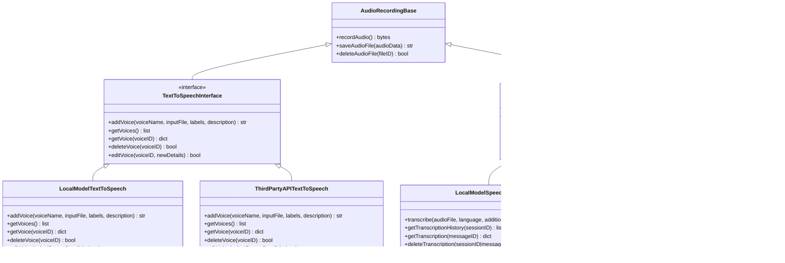
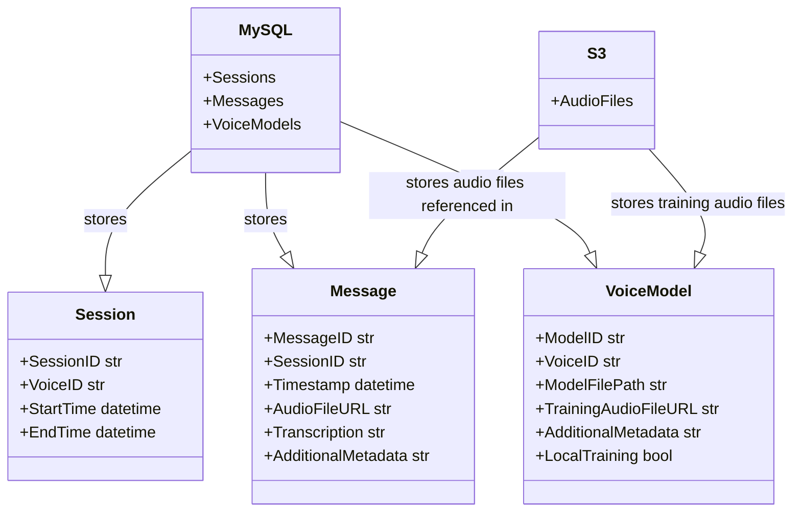
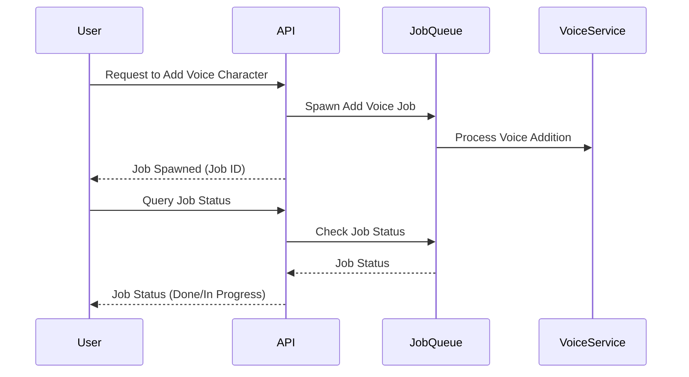
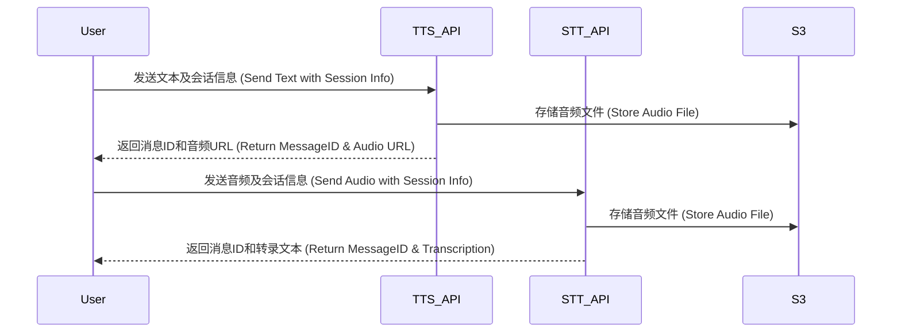
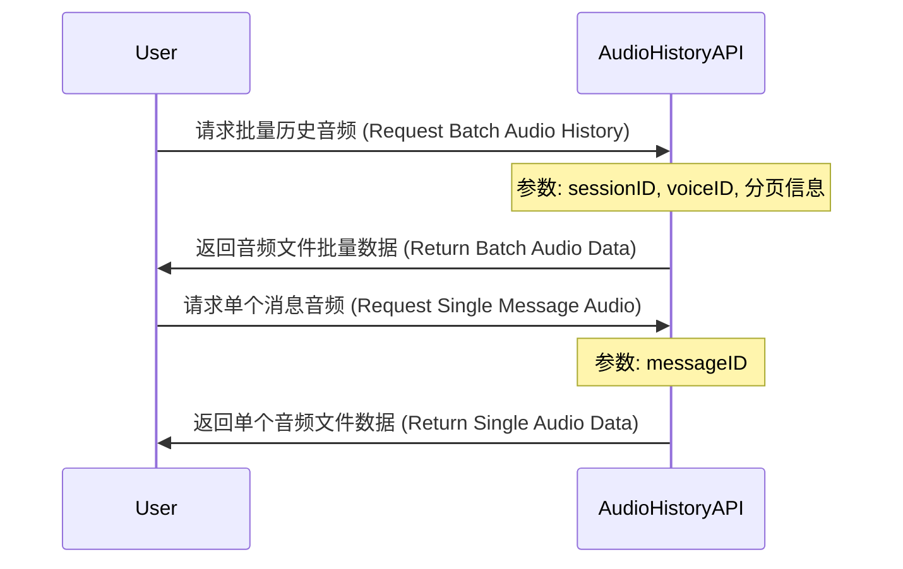
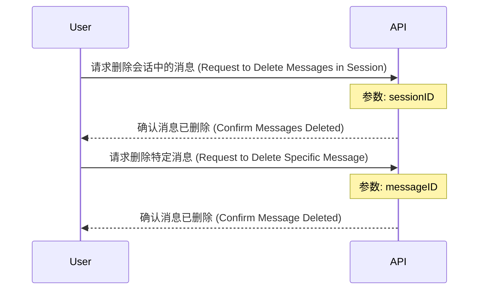

### Text-to-Speech and Speech-to-Text Interfaces
这个类图展示了音频录制基类及其继承的文本转语音和语音转文本接口。每个接口包含了相关的方法，如添加声音、获取声音列表、转录音频等。

### Data Storage in MySQL and S3
此类图描述了在 MySQL 和 S3 中存储数据的结构。MySQL 存储会话和消息的元数据，而 S3 用于存储音频文件。会话和消息之间的关系也被表示出来。

### Asynchronous Voice Character Addition
此顺序图展示了异步添加声音特征的过程。用户请求添加声音后，API 将任务加入消息队列，然后由工作处理器处理。用户还可以查询任务的状态。

### TTS and STT Processes with S3 Storage
这个顺序图说明了文本转语音和语音转文本过程中与 S3 存储的交互。在这两个过程中，生成的音频文件被存储在 S3 中，并返回相关的消息 ID 和音频 URL。

### Retrieving Audio History with Pagination
用户通过 sessionID 和 userID 请求批量历史音频数据，可能包括分页信息。
API 返回相关音频文件的批量数据，包括音频URL、转录文本和元数据。
对于单个消息，用户提供 messageID，API 返回相应的音频文件数据

### Deleting Messages
这个顺序图展示了删除消息的API调用流程。用户可以请求删除特定会话中的所有消息或删除特定的单个消息。

