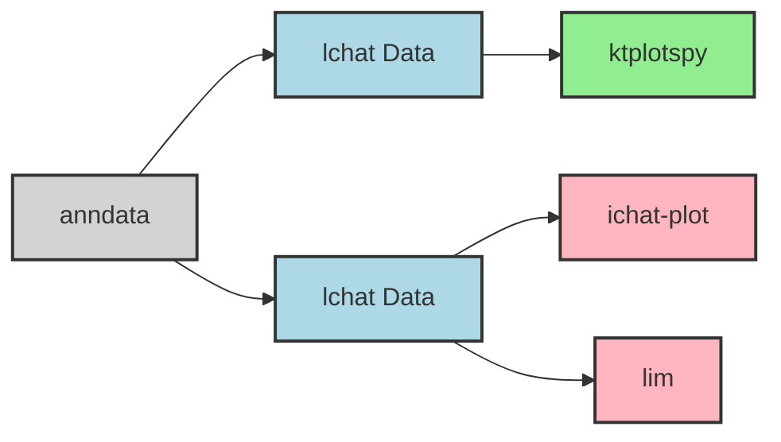

```mermaid
flowchart LR
    A[anndata] --> B[lchat Data]
    A --> C[lchat Data]
    B --> D[ktplotspy]
    C --> E[ichat-plot]
    C --> F[lim]
    
    classDef default fill:#d3d3d3,stroke:#333,stroke-width:2px;
    classDef box1 fill:#add8e6,stroke:#333,stroke-width:2px;
    classDef box2 fill:#90ee90,stroke:#333,stroke-width:2px;
    classDef box3 fill:#ffb6c1,stroke:#333,stroke-width:2px;

    class A default;
    class B,C box1;
    class D box2;
    class E,F box3;


```